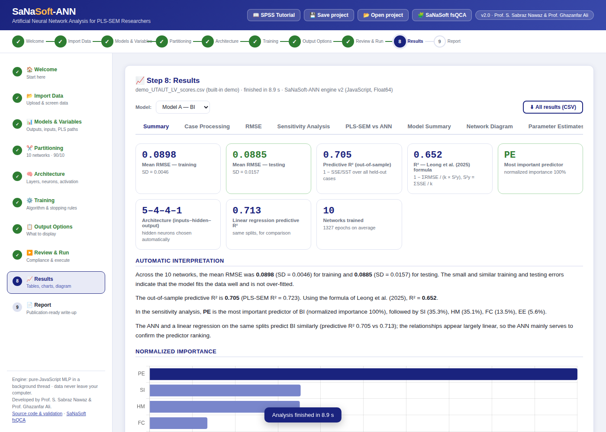

# SaNaSoft-ANN

**Free, guided artificial neural network (ANN) analysis for PLS-SEM + ANN hybrid research.**

**Developed by Prof. S. Sabraz Nawaz and Prof. Ghazanfar Ali.** Part of the SaNaSoft suite — see also [SaNaSoft fsQCA](https://samssabraznawaz.github.io/sanasoft/) for configurational analysis of the same latent variable scores.

SaNaSoft-ANN reproduces the SPSS Multilayer Perceptron and automates the complete procedure recommended by
[Leong et al. (2025)](https://doi.org/10.1080/08874417.2024.2329128) — ten networks with 90/10 partitioning
(ten-fold cross-validation), RMSE tables, R², the averaged sensitivity analysis, and the PLS-SEM vs ANN
comparison — and writes a publication-ready report. It runs entirely in your web browser: no installation,
no licence, and your data never leave your computer.

**▶ Use it online:** https://samssabraznawaz.github.io/sanasoft/ann/
&nbsp;·&nbsp; **⬇ Offline:** download [`index.html`](index.html) (this folder) and double-click it.

[](https://github.com/samssabraznawaz/sanasoft/actions/workflows/ann-tests.yml)
[](../LICENSE)



---

## Who is it for?

Researchers in management, information systems, marketing, education, tourism and other social sciences who
have finished a PLS-SEM analysis (e.g., in SmartPLS) and want to run the second, ANN stage of the hybrid
approach — without SPSS and without programming.

## Features

| | |
|---|---|
| **Guideline-compliant** | Implements Leong et al. (2025) step by step, with a 12-point compliance checker before you run. |
| **Ten networks, automatically** | k-fold cross-validation (default 10 × 90/10) or repeated random splits; RMSE and importance averaged across networks. |
| **Several models at once** | One ANN per endogenous construct (Model A, B, C …) in a single run. |
| **SPSS-style output** | Case processing summary, model summary (SSE, relative error, stopping rule), parameter estimates (synaptic weights), network diagram. |
| **Sensitivity analysis** | Relative importance per network, average relative importance, normalized importance (%). |
| **PLS-SEM vs ANN** | Ranking comparison table ("Matched / Not matched") from the path coefficients you enter. |
| **Diagnostics** | Training curves, predicted vs observed, residuals, linear-regression benchmark on identical splits, Ramsey RESET linearity test, VIF, descriptive statistics. |
| **Report** | Method and results text with APA-formatted tables; APA 7th, APA 6th, Harvard, Emerald, Chicago, IEEE or Vancouver (the same styles as SaNaSoft fsQCA, plus APA 6th); download as Word, HTML or print to PDF. |
| **Fast** | Purpose-built JavaScript engine in a background thread — a full ten-network analysis takes seconds. |
| **Reproducible** | Seeded random numbers: same data + settings + seed ⇒ identical results. Projects can be saved and reopened. |
| **SPSS tutorial** | Built-in tutorial showing each SPSS dialog next to its SaNaSoft-ANN equivalent. |

## Quick start

1. Export the **latent variable scores** from your PLS-SEM software as CSV or Excel (one row per respondent).
2. Open SaNaSoft-ANN and go to **Import Data** (or click **Try with demo data**).
3. In **Models & Variables**, choose the output construct and its significant predictors for each model;
   optionally enter the PLS-SEM path coefficients and R².
4. Keep the defaults (they follow Leong et al., 2025) or adjust partitioning, architecture and training.
5. **Review & Run** → inspect the **Results** → download the **Report**.

An example dataset is in [`examples/demo_UTAUT_LV_scores.csv`](examples/demo_UTAUT_LV_scores.csv).

## Method in brief

| Setting | Default | Source |
|---|---|---|
| Network | Multilayer perceptron, 2 hidden layers | Leong et al. (2025) |
| Hidden neurons | Automatic (grid search; smallest network within 2% of the best testing error) | Leong et al. (2025) |
| Activation | Sigmoid (hidden and output) | Leong et al. (2025) |
| Training | FFBP — batch gradient descent with momentum (SCG and Adam also available) | Leong et al. (2025); Møller (1993); Kingma & Ba (2015) |
| Partitioning | 10-fold cross-validation (90% training / 10% testing per network) | Leong et al. (2025) |
| Rescaling | Covariates standardized; output normalized to 0–1 for a sigmoid output | SPSS convention |
| Fit | RMSE = √(SSE/n) for training and testing | Leong et al. (2025) |
| R² | Predictive (out-of-sample) R², and the formula printed in Leong et al. (2025) | — |
| Importance | Permutation sensitivity analysis, averaged over networks, normalized to the maximum | Leong et al. (2025); Breiman (2001) |

Full details: [docs/methodology.md](docs/methodology.md). Validation results: [docs/validation.md](docs/validation.md).

## How to cite

If you use SaNaSoft-ANN in your research, please cite the software and the guideline it implements. The report
generated in Step 9 inserts the software citation automatically in the style you choose.

> Samsudeen, S. N., & Ghazanfar, A. A. (2026). *SaNaSoft-ANN: Guided artificial neural network analysis for PLS-SEM
> latent variable scores* (Version 2.0) [Computer software]. https://samssabraznawaz.github.io/sanasoft/ann/

> Leong, L.-Y., Hew, T.-S., Ooi, K.-B., Tan, G. W.-H., & Koohang, A. (2025). An SEM-ANN approach – Guidelines in
> information systems research. *Journal of Computer Information Systems, 65*(6), 706–737.
> https://doi.org/10.1080/08874417.2024.2329128

The citation link is set in one line in `src/app-report.js` (`SOFTWARE_URL`); the version in `src/app-core.js` (`VERSION`).

## Privacy

All computation happens locally in your browser. No data are uploaded anywhere. The page loads three open-source
libraries (PapaParse, SheetJS, Chart.js) and a web font from public CDNs; everything else is contained in
`index.html`.

## For developers

All commands are run from this `ann/` folder.

```
src/                 application sources (engine, UI, report, tutorial, styles)
build.js             assembles src/ into the single-file index.html
tests/engine.test.js engine unit tests (gradient check, reproducibility, formulas)
tests/e2e/           browser end-to-end test (Playwright)
tests/calibration/   comparison with scikit-learn on identical folds
```

```bash
node build.js                     # rebuild index.html after editing src/
node --test tests/engine.test.js  # unit tests (Node.js ≥ 18, no dependencies)
python tests/e2e/test_app.py      # end-to-end test (pip install playwright)
```

See [CONTRIBUTING.md](CONTRIBUTING.md) and [docs/maintainer-guide.md](docs/maintainer-guide.md). Bug reports and feature requests are welcome in
[Issues](https://github.com/samssabraznawaz/sanasoft/issues).

## Known limitations

- Early stopping uses the testing sample (as SPSS does), so testing errors are slightly optimistic; use a holdout
  sample for a fully independent check.
- Importance values for weak or interaction-only predictors can depend on the training algorithm; consider
  re-running with SCG as a robustness check (see [docs/validation.md](docs/validation.md)).
- Radial basis function (RBF) networks and categorical outputs are not yet supported.
- Results are statistically comparable to, but not numerically identical with, SPSS (different random
  initialisation and implementation details). A formal SPSS comparison is in progress.

## Licence

[MIT](../LICENSE) © 2026 Prof. S. Sabraz Nawaz and Prof. Ghazanfar Ali.
